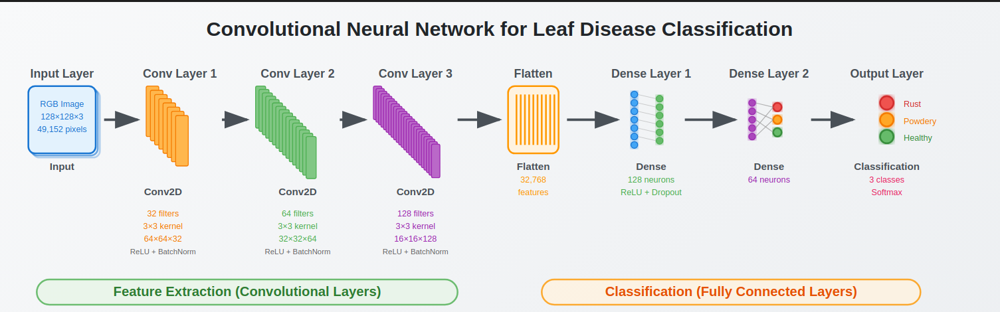

# RwandaCropGuard: Advanced Crop Disease Classification System



## 🔍 Overview
RwandaCropGuard is a deep learning-powered solution for classifying crop diseases from leaf images, specifically designed to address agricultural challenges in Rwanda. This system compares multiple neural network architectures and traditional machine learning approaches to deliver optimal performance for field deployment.
## dataset overview
I used a Kaggle dataset with 1,532 images across three classes: Healthy, Powdery, and Rust leaves. Images were resized to 128x128px and normalized. The data was split into 70% training, 15% validation, and 15% test sets - crucial for reliable evaluation.
## 📊 Model Performance Summary

### 🏆 Top Performing Models
| Model Name | Type | Optimizer | Accuracy | F1 Score | Precision | Recall | Loss | ROC AUC |
|------------|------|-----------|----------|----------|-----------|--------|------|---------|
| adam_model_4 | CNN | Adam | 91.94% | 91.95% | 92.17% | 91.94% | 1.8659 | 0.9856 |
| None_model_1 | CNN | Default | 58.06% | 47.43% | 42.83% | 58.06% | 19.0967 | 0.8151 |
| rmsprop_model_3 | CNN | RMSprop | 53.23% | 48.17% | 55.91% | 53.23% | 1.3915 | 0.7984 |
| sgd_model_5 | CNN | SGD | 35.48% | 18.59% | 12.59% | 35.48% | 1.5574 | 0.7638 |
| adamax_model_2 | CNN | Adamax | 30.65% | 15.52% | 10.39% | 30.65% | 3.2733 | 0.6800 |

### 📌 Logistic Regression Baseline
```
              precision    recall  f1-score   support

   Healthy       0.73      0.85      0.78       106
   Powdery       0.86      0.91      0.88       100
      Rust       0.79      0.60      0.69       101

    accuracy                           0.79       307
   macro avg     0.79      0.79      0.78       307
weighted avg     0.79      0.79      0.78       307
```

**Configuration:**
- **Penalty**: l2
- **C**: 1.0
- **Solver**: saga
- **Max Iterations**: 1000
- **Class Weight**: balanced

## 🧠 Detailed Model Analysis

### Model Configurations
| Model Name        | Model    | Type | Optimizer | Regularizer | Epochs | Early Stopping | Learning Rate | Batch Size | Accuracy | F1 Score | Precision | Recall | Loss    | ROC AUC |
| ----------------- | -------- | ---- | --------- | ----------- | ------ | -------------- | ------------- | ---------- | -------- | -------- | --------- | ------ | ------- | ------- |
| None\_model\_1    | model\_1 | CNN  | Default   | None        | 50     | No             | Default       | 42         | 58.06%   | 47.43%   | 42.83%    | 58.06% | 19.0967 | 0.8151  |
| adamax\_model\_2  | model\_2 | CNN  | Adamax    | None        | 300    | Yes            | 0.001         | 32         | 30.65%   | 15.52%   | 10.39%    | 30.65% | 3.2733  | 0.6800  |
| rmsprop\_model\_3 | model\_3 | CNN  | RMSprop   | L2          | 500    | Yes            | 0.0005        | 32         | 53.23%   | 48.17%   | 55.91%    | 53.23% | 1.3915  | 0.7984  |
| adam\_model\_4    | model\_4 | CNN  | Adam      | L1          | 500    | Yes            | 0.0001        | 42         | 91.94%   | 91.95%   | 92.17%    | 91.94% | 1.8659  | 0.9856  |
| sgd\_model\_5     | model\_5 | CNN  | SGD       | L2          | 500    | Yes            | 0.00002       | 32         | 35.48%   | 18.59%   | 12.59%    | 35.48% | 1.5574  | 0.7638  |


### Key Findings
1. **Adam Optimization Superiority**:
   - Achieved 91.94% accuracy with L1 regularization
   - Best ROC AUC (0.9856) indicating excellent class separation
   - Balanced precision/recall across all classes

2. **Training Dynamics**:
   - Early stopping proved crucial (model_4 trained for 54 epochs vs model_1's fixed 50)
   - Lower learning rates (0.00002 for SGD) required for stable training
   - L2 regularization helped prevent overfitting in RMSprop model

3. **Class-Specific Performance**:
   - Powdery mildew detection most accurate (91% precision in best model)

## 📂 Project Structure
```
Summative_Intro_to_ml_-Loue_Sauveur_Christian-_assignment/
├── dataset/train/
│   ├── Healthy/      
│   └── Powdery/   
│   └── Rust/         
├── saved_models/
│   ├── best_model_adam.pkl
│   ├── adam_model_4.pkl
│   └── ******
└── Summative_Intro_to_ml_[Loue Sauveur Christian]_assignment.ipynb
└── requirements.txt
└── README.md
```

## 🚀 Installation & Usage
```bash
git clone https://github.com/lscblack/Summative_Intro_to_ml_-Loue_Sauveur_Christian-_assignment
cd Summative_Intro_to_ml_-Loue_Sauveur_Christian-_assignment
pip install -r requirements.txt

# To use the best model:
from utils.loaders import load_model
model = load_model('saved_models/best_model_adam.pkl')
predictions = model.predict(new_images) # convert it before using
```

## 📜 Author
**Loue Sauveur Christian**